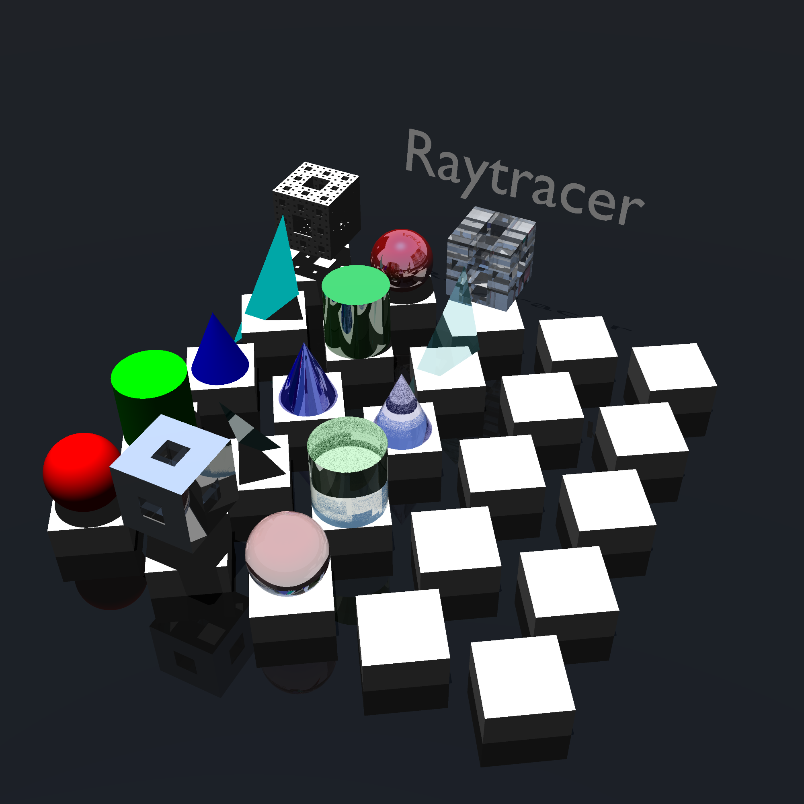

# Raytracer



A 3D raytracer implementation that renders scenes to PPM files. This project progressively implements various rendering features from basic primitives and lighting to advanced materials and optimizations.

## Features

This feature set is the one asked by our school.
COULDs are practically bonuses and each had a given number of points. Out of 40.5 possible bonus points, we have 20.5

### MUST (Required)

#### Primitives
- [x] Sphere
- [x] Plane

#### Transformations
- [x] Translation

#### Lighting
- [x] Directional Light
- [x] Ambient Light

#### Materials
- [x] Flat Color

#### Scene Configuration
- [x] Add Primitives to Scene
- [x] Set Up Lighting
- [x] Set Up Camera

#### Interface
- [x] PPM File Output

### SHOULD (Important)

#### Primitives
- [x] Cylinder
- [x] Cone

#### Transformations
- [x] Rotation

#### Lighting
- [x] Drop Shadows

### COULD (Nice to Have)

#### Primitives
- [x] Limited Cylinder
- [x] Limited Cone
- [ ] Torus
- [ ] Tanglecube
- [x] Triangles
- [x] .OBJ File Support
- [x] Fractals
- [ ] Möbius Strip

#### Transformations
- [x] Scale
- [ ] Shear
- [ ] Transformation Matrix
- [ ] Scene Graph

#### Lighting
- [x] Multiple Directional Lights
- [x] Multiple Point Lights
- [x] Colored Light
- [x] Phong Reflection Model
- [ ] Ambient Occlusion

#### Materials
- [x] Transparency
- [x] Refraction
- [x] Reflection
- [ ] Texturing from File
- [ ] Procedural Texturing (Chessboard)
- [ ] Procedural Texturing (Perlin Noise)
- [ ] Normal Mapping

#### Scene Configuration
- [x] Import Scene in Scene
- [x] Antialiasing (Supersampling)
- [x] Antialiasing (Adaptive Supersampling)

#### Interface
- [ ] Display Image During Generation
- [ ] Display Image After Generation
- [ ] Exit During Generation
- [ ] Exit After Generation
- [ ] Scene Preview (Basic Fast Renderer)
- [ ] Automatic Reload on File Change

#### Optimizations
- [x] Space Partitioning
- [x] Multithreading
- [x] Clustering (Network-based Rendering)

## Getting Started

### Prerequisites

- Rust 1.70+ (for edition 2024)
- Cargo (comes with Rust)

### Installation

Clone the repository:

```bash
git clone https://codeberg.org/Inkurey22/raytracer.git
cd raytracer
```

## Building

Build the project using Cargo: 

```bash
cargo build --release    # Release build
cargo build              # Debug build
cargo clean              # Clean artifacts
```

The binary will be created as `raytracer` in `target/release/` or `target/debug/`.

### Running Tests

```bash
make test
```

## Usage

Run the raytracer with a scene configuration file:

```bash
./raytracer <config-file> [options]
```

### Options

- `-o, --output <file>` - Output PPM file path (default: output.ppm)
- `--width <pixels>` - Image width (overrides config)
- `--height <pixels>` - Image height (overrides config)
- `--samples-per-pixel <count>` - Samples per pixel for antialiasing
- `--variance-threshold <value>` - Adaptive sampling variance threshold
- `--server` - Run as clustering server
- `--client <address>` - Connect as clustering client
- `-h, --help` - Show help message

### Examples

```bash
# Render with default config and output
./raytracer configs/example.toml

# Render with custom output and dimensions
./raytracer configs/example.toml -o my_scene.ppm --width 1920 --height 1080

# Render with supersampling
./raytracer configs/example.toml --samples-per-pixel 4
```

### Scene Configuration

Scene files are written in TOML format and define:
- Camera settings (position, direction, field of view)
- Lighting setup (ambient and directional lights)
- Objects (primitives with transformations and materials)
- Output settings

See `configs/example.toml` for a complete example configuration.

## Architecture

The raytracer is organized as a modular Rust project with a main binary and specialized crates for different components:

### Core Modules

- **vec3** - 3D vector mathematics (position, direction, operations)
- **color** - Color representation and operations
- **ray** - Ray definition and ray-object intersection
- **orientation** - 3D rotation and angle representation
- **camera** - Camera setup, projection, and view transformation

### Objects (Primitives)

Each primitive type is implemented as a separate crate:
- **object_interface** - Trait definition for all renderable objects
- **sphere** - Sphere primitive
- **plane** - Infinite plane primitive
- **cylinder** - Cylinder primitive
- **cone** - Cone primitive
- **triangle** - Triangle primitive
- **cuboid** - Box/cuboid primitive
- **menger** - Menger sponge fractal
- **obj_file** - OBJ file loader for mesh support

All primitives implement the `Object` trait for unified ray-intersection testing and material evaluation.

### Lighting

Each light type is a separate crate:
- **light_interface** - Trait definition for all light sources
- **ambiant** - Ambient light (uniform scene illumination)
- **directional_light** - Directional light (sun-like)
- **omni_light** - Omnidirectional point light

### Main Binary

The main binary (`src/`) handles:

- **args.rs** - Command-line argument parsing and validation
- **config_parse.rs** - TOML scene configuration loading and parsing
- **raytracing.rs** - Core rendering algorithm:
  - Ray casting and intersection testing
  - Adaptive supersampling for antialiasing
  - Multithreaded rendering
  - PPM file output
- **main.rs** - Entry point, orchestration, and clustering support (server/client modes)
- **utilities/** - Helper functions

### Rendering Pipeline

1. **Scene Loading** - Parse TOML config file
2. **Camera Setup** - Initialize camera with position and orientation
3. **Ray Generation** - Generate rays from camera through each pixel
4. **Intersection Testing** - Find closest object intersecting each ray
5. **Shading** - Compute pixel color based on:
   - Object material properties
   - Lighting contributions (ambient + directional)
   - Normal vectors and surface properties
6. **Antialiasing** - Adaptive supersampling with variance threshold
7. **Output** - Write rendered image to PPM file

### Key Design Patterns

- **Trait-based Architecture** - Objects and lights use traits for extensibility
- **Modular Crates** - Each feature is isolated for independent development and testing
- **Multithreading** - Renders image rows in parallel for performance
- **Configuration-Driven** - Scene definition in human-readable TOML format
- **Clustering Support** - Optional distributed rendering via TCP server/client mode
